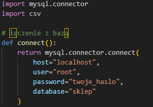
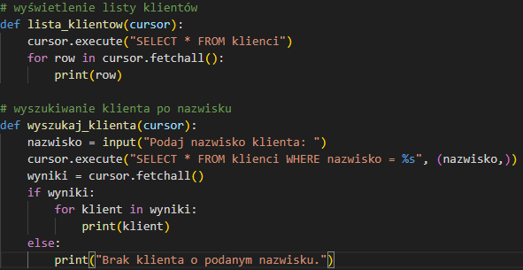
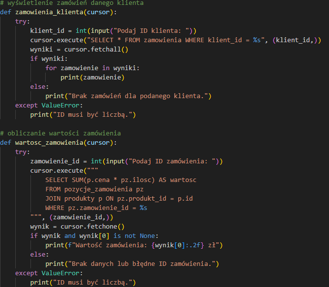
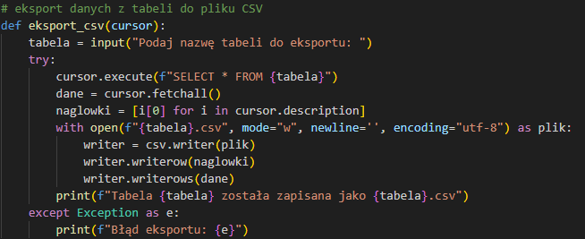
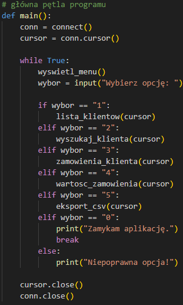
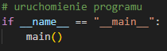

# 1. Połączenie z bazą danych

```python
import mysql.connector
import csv

# łączenie z bazą
def connect():
    return mysql.connector.connect(
        host="localhost",
        user="root",
        password="twoje_haslo",
        database="sklep"
    )
```
# 2. Zarządzanie klientami

```python
# wyświetlenie listy klientów
def lista_klientow(cursor):
    cursor.execute("SELECT * FROM klienci")
    for row in cursor.fetchall():
        print(row)

# wyszukiwanie klienta po nazwisku
def wyszukaj_klienta(cursor):
    nazwisko = input("Podaj nazwisko klienta: ")
    cursor.execute("SELECT * FROM klienci WHERE nazwisko = %s", (nazwisko,))
    wyniki = cursor.fetchall()
    if wyniki:
        for klient in wyniki:
            print(klient)
    else:
        print("Brak klienta o podanym nazwisku.")
```
# 3 Obsługa zamówień

```python
# wyświetlenie zamówień danego klienta
def zamowienia_klienta(cursor):
    try:
        klient_id = int(input("Podaj ID klienta: "))
        cursor.execute("SELECT * FROM zamowienia WHERE klient_id = %s", (klient_id,))
        wyniki = cursor.fetchall()
        if wyniki:
            for zamowienie in wyniki:
                print(zamowienie)
        else:
            print("Brak zamówień dla podanego klienta.")
    except ValueError:
        print("ID musi być liczbą.")

# obliczanie wartości zamówienia
def wartosc_zamowienia(cursor):
    try:
        zamowienie_id = int(input("Podaj ID zamówienia: "))
        cursor.execute("""
            SELECT SUM(p.cena * pz.ilosc) AS wartosc
            FROM pozycje_zamowienia pz
            JOIN produkty p ON pz.produkt_id = p.id
            WHERE pz.zamowienie_id = %s
        """, (zamowienie_id,))
        wynik = cursor.fetchone()
        if wynik and wynik[0] is not None:
            print(f"Wartość zamówienia: {wynik[0]:.2f} zł")
        else:
            print("Brak danych lub błędne ID zamówienia.")
    except ValueError:
        print("ID musi być liczbą.")
```
# 4 Eksport danych

```python
# eksport danych z tabeli do pliku CSV
def eksport_csv(cursor):
    tabela = input("Podaj nazwę tabeli do eksportu: ")
    try:
        cursor.execute(f"SELECT * FROM {tabela}")
        dane = cursor.fetchall()
        naglowki = [i[0] for i in cursor.description]
        with open(f"{tabela}.csv", mode="w", newline='', encoding="utf-8") as plik:
            writer = csv.writer(plik)
            writer.writerow(naglowki)
            writer.writerows(dane)
        print(f"Tabela {tabela} została zapisana jako {tabela}.csv")
    except Exception as e:
        print(f"Błąd eksportu: {e}")
```
# 5 Menu główne

```python
# główna pętla programu
def main():
    conn = connect()
    cursor = conn.cursor()

    while True:
        wyswietl_menu()
        wybor = input("Wybierz opcję: ")

        if wybor == "1":
            lista_klientow(cursor)
        elif wybor == "2":
            wyszukaj_klienta(cursor)
        elif wybor == "3":
            zamowienia_klienta(cursor)
        elif wybor == "4":
            wartosc_zamowienia(cursor)
        elif wybor == "5":
            eksport_csv(cursor)
        elif wybor == "0":
            print("Zamykam aplikację.")
            break
        else:
            print("Niepoprawna opcja!")

    cursor.close()
    conn.close()
```
# 6 Uruchomienie programu

```python
# uruchomienie programu
if __name__ == "__main__":
    main()
```